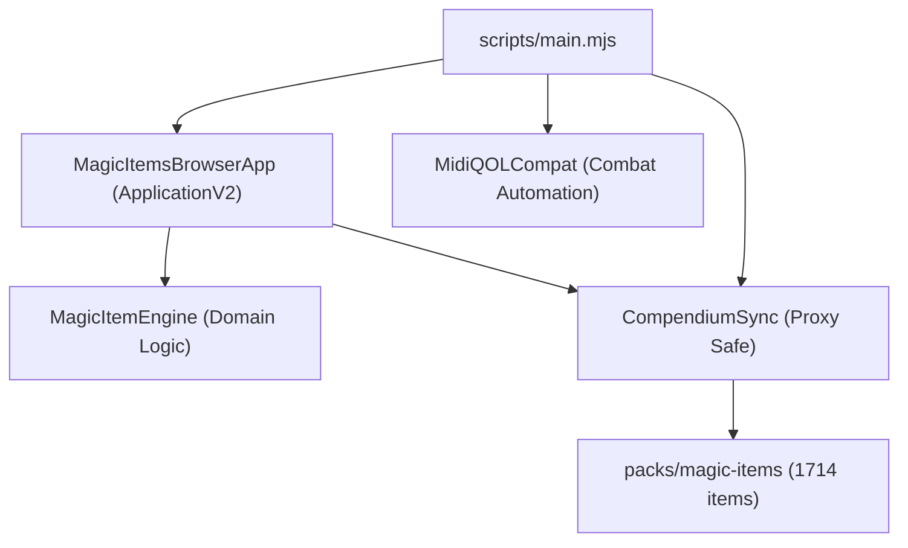

# Magic Items Expansion (Itens Mágicos)

[English](README.md) | [Português (Brasil)](README.pt-BR.md)

[](https://foundryvtt.com/)
[](https://github.com/foundryvtt/dnd5e)
[](https://gitlab.com/tposney/midi-qol)
[](tests/)
[](LICENSE)

A comprehensive magic items module for **Foundry Virtual Tabletop (V12 to V14)** and **D&D 5e (v3.0+ and v4.0+)**, integrating the complete collection of **1,714 magic items** from **The Griffon's Saddlebag: The Inventory** across all volumes with bilingual compendiums, full **Midi-QOL** combat automation alignment, and an interactive **ApplicationV2** browser.

---

## Highlights

- **1,714 Unique Magic Items:** Full integration of The Griffon's Saddlebag (Years 1–7) with 100% deterministic 16-character IDs.
- **Interactive ApplicationV2 Browser:** Modern, responsive interface featuring real-time search, multi-criteria filtering, cursor focus preservation, and one-click item granting to actor sheets.
- **Midi-QOL & Combat Automation Alignment:** Weapons preconfigured with action types (`mwak`/`rwak`), base damage parts, and combat automation flags, gracefully degrading when Midi-QOL is inactive.
- **Domain-Driven Magic Item Engine:** Pure domain rules for attunement eligibility (including Artificer 4/5/6 slot scaling), charge and dawn-recharge parsing, and DMG/Xanathar market pricing.
- **Bilingual Compendium Parity:** Full dual-language data (`en` and `pt-BR`) with 1:1 ID symmetry and reverse-proxy safe route resolution.
- **Automated Test Suite:** 28 automated tests running natively via the Node.js test runner covering manifests, compendium integrity, domain rules, UI states, and localization symmetry.

---

## Domain and Feature Tables

### Item Collection by Volume

| Volume / Source | Publication Period | Item Count | Primary Types | Rules Focus |
| :--- | :---: | :---: | :--- | :--- |
| **Years 1–3** | 2019–2021 | 864 | Weapons, Wondrous Items, Armor | Classic D&D 5e (2014) |
| **Year 4** | 2022 | 240 | Weapons, Wands, Rings, Consumables | Mid-Tier Expansion |
| **Year 5** | 2023 | 241 | Equipment, Weapons, Relics | Advanced Synergy Items |
| **Year 6** | 2024 | 247 | Weapons, Armor, Implements | Revised 2024 Alignment |
| **Year 7** | 2025 | 122 | High-Level Relics, Wondrous Gear | Modern 2024 Mechanics |

### Market Pricing by Rarity Guidelines

| Rarity | DMG Market Range | Standard Default Price | Consumable Price (Halved) | Attunement Baseline |
| :--- | :---: | :---: | :---: | :---: |
| **Common** | 50–100 gp | 100 gp | 50 gp | Optional / None |
| **Uncommon** | 101–500 gp | 500 gp | 250 gp | Varies |
| **Rare** | 501–5,000 gp | 5,000 gp | 2,500 gp | Commonly Required |
| **Very Rare** | 5,001–50,000 gp | 50,000 gp | 25,000 gp | Required |
| **Legendary** | 50,001–200,000 gp | 100,000 gp | 50,000 gp | Required |
| **Artifact** | 200,001–500,000 gp | 500,000 gp | 250,000 gp | Bound to Destiny |

---

## Architecture and Interfaces



- **`MagicItemsBrowserApp` (`ApplicationV2`):** Two-column layout providing real-time multi-filter queries (query text, rarity, item type, attunement, volume), target character selection, and direct inventory item creation.
- **`MagicItemEngine`:** Pure domain service calculating attunement constraints (validating total attuned items and Artificer level 10/14/18 thresholds), parsing charges and dawn recoveries, and computing standard prices.
- **`CompendiumSync`:** Safely resolves proxy prefixes via `foundry.utils.getRoute` and populates compendiums on initial module activation.
- **`MidiQOLCompat`:** Detects Midi-QOL presence, registers workflow hooks, and normalizes item source IDs without creating hard dependencies.

---

## Installation

Install directly within the Foundry VTT Setup menu using the manifest link:

```text
https://raw.githubusercontent.com/NeroHeiser/itensdndmagic/main/module.json
```

Or extract the repository archive into your Foundry data folder:
```text
<FoundryData>/Data/modules/itensmagicos
```

---

## Automated Testing and Quality

The module features a native unit test suite with zero external testing dependencies:

```bash
# Run the complete test suite
npm test
```

Audited invariants:
- **Manifest integrity:** Validates compatibility bounds (v12-v14) and required module fields.
- **Data integrity:** Asserts physical existence of 1,714 items with 16-character IDs and 1:1 ID parity across locales.
- **Domain calculations:** Verifies price scaling, attunement slots, and charge regex parsing.
- **UI & Localization:** Validates focus preservation, ApplicationV2 default options, and 100% Handlebars key coverage.

---

## Compatibility and License

- **Foundry VTT:** Verified for v12 and v14.
- **Game System:** `dnd5e` v3.0+ and v4.0+.
- **Recommended Automation:** [Midi-QOL](https://gitlab.com/tposney/midi-qol).
- **Source Material:** Based on **The Griffon's Saddlebag: The Inventory** by The Griffon's Saddlebag LLC.
- **Module Author:** [André Luiz (Lopes / NeroHeiser)](https://github.com/NeroHeiser).
- **License:** [MIT](LICENSE).
